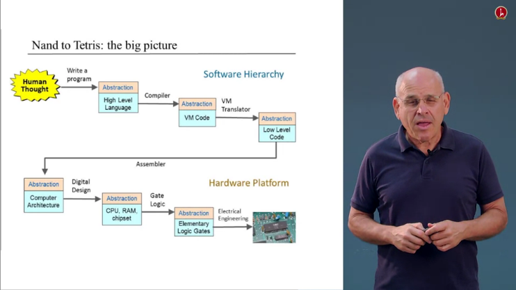
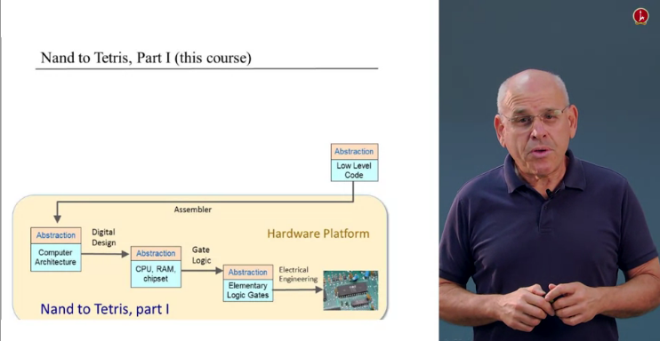

# BUILD A COMPUTER FROM FIRST PRINCIPLES

- **Platform** Coursera 
- **University** Hebrew University of Jerusalem 
- **Cost** Free to audit; $49 for certification 
- **Text** The Elements of Computing Systems: Building a Modern Computer from First Principles *Noam Nisan*, *Shimon Schocken* [Link](https://www.amazon.com/Elements-Computing-Systems-Building-Principles/dp/0262640686)
- **Software** [Nand2Tetris](https://www.nand2tetris.org/software)
- **Faculty** [Noam Nisan](http://www.cs.huji.ac.il/~noam/) [Shimon Schocken](http://www.cs.huji.ac.il/~noam/)

## OVERVIEW 

The Nand to Tetris course takes you on a self-paced fascinating voyage of discovery in which you will go all the way from Boolean algebra and elementary logic gates to building a Central Processing Unit, a memory system, and a hardware platform, leading up to a general-purpose computer that can run any program that you fancy. In the process of building this computer you will become familiar with many important hardware abstractions, and you will implement them, hands on. But most of all, you will enjoy the tremendous thrill of building a complex and useful system from the ground up.

- *Project 1*: Building elementary logic gates like **And**, **Or**, **Not**, **Multiplexor**, and more
- *Project 2*: Building a family of adder chips, culminating in the construction of an **Arithmetic Logic Unit (ALU)**  
- *Project 3*: Building registers and memory units, culminating in the construction of a **Random Access Memory (RAM)**
- *Project 4*: Learning a machine language and using it to write some illustrative low-level programs
- *Project 5*: UGsing the chipset built in projects 1-3 to build **Central Processing Unit (CPU)** and a hardware platform capable of executing programs written in the machine language introduced in project 4
- *Project 6*: Developing an assembler, i.e. a capability to translate programs written in symbolic machine language into binary, executable code

## PREREQUISITE KNOWLEDGE 

In order to take this course you have to know... well... absolutely nothing about computer science or engineering! All the knowledge necessary to build the computer and complete this course successfully is given in the course lectures and projects. The only prerequisites are curiosity and passion to build a cool working example of the most important invention of the 20th century. 

## MODULE 0

- Unit 0.0:  **Introduction** 

- Professors Schocken and Nisan introduce themselves 
     - This course is divided into designing a working computer, hardware and software 
             - This course will focus on the *first aspect, which is the hardware* 
          - In Nand2Tetris Part II, we will focus on the software hierarchy 
          - 7 weeks, 6 projects, 0 assumed prior knowledge

   

- Unit 0.1:  **The Road Ahead** 

    - Many of you may have taken a programming lesson 
    - It's tradition to start with the 'Hello World' command to output that phrase 
    - At this point you are focusing on the syntax that is relevant to that respective programming language 
    - There is however deeply problematic 
    - When we code print 'Hello, World!', we are rarely aware of what is happening underneath the hood as it were 
    - For instance, the letter 'P' which is the first word in the command *print* is meaningless at the deepest level of computers, where it is all but 0s and 1s 
    - The letter 'P' is represented by the letter 112 in ASCII. The letter 'R' is 114, and so on 
    - When these letters are typed together in a programming language, something is happening - how does that happen? 
    - When you ask a program to print 'Hello, World!' you are commanding the computer to output the phrase, at which point the computer is making decisions with regard to pixels on your screen to be lighter or darker 
    - These decisions eventually lead to the Hello World phrase being rendered on screen - again, how is that happening? 
    - In both the cases we discussed above, the question of 'How?' is usually swept under the rug
    - Usually the 'how' is answered with allusions to the Operating System and standard libraries that do the work on your behalf 
    - The secret of computer science is that you really *don't have to worry about them* 
    -

- Unit 0.2:  **From Nand to Hack** 

- Unit 0.3:  **From Hack to Tetris** 

- Unit 0.4:  **Project Overview** 

